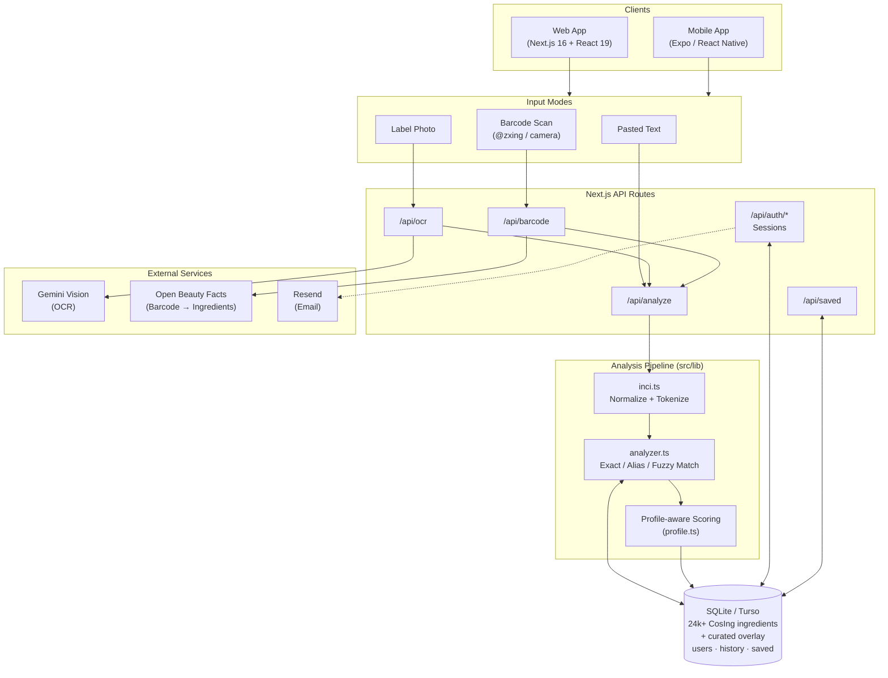

# SkinGuard: An Intelligent Skincare Ingredient Analysis System

**Author(s):** Maithili Dorkhande
**Affiliation:** St. Vincent Pallotti College of Engineering and Technology, Nagpur
**Date:** July 2026

---

## Abstract

Consumers of cosmetic and skincare products are routinely exposed to ingredient lists written in dense INCI (International Nomenclature of Cosmetic Ingredients) terminology that is effectively unreadable to non-experts. SkinGuard addresses this problem by providing an end-to-end system that converts a product label — pasted as text, photographed, or scanned via barcode — into a structured, personalized safety report. The system parses raw INCI strings, matches each token against a database of 24,000+ ingredients derived from the EU CosIng catalogue enriched with a curated overlay of safety ratings, comedogenicity scores, pregnancy-safety flags, and fragrance/allergen classifications, and then evaluates the formula against the user's skin profile (skin type and concerns). Label photographs are processed with Gemini Vision for OCR, and barcodes are resolved through the Open Beauty Facts API. The platform is implemented as a Next.js 16 web application with a SQLite/Turso backend and a companion Expo (React Native) mobile app with live camera scanning. Results show accurate ingredient matching on real-world labels, including recovery from poorly punctuated OCR output, with per-ingredient explanations and formula-level verdicts delivered in under a second for typical 30–50 ingredient lists. SkinGuard demonstrates that regulatory ingredient databases, lightweight heuristics, and modern vision models can be combined into a practical consumer safety tool.

## 1. Introduction

Skincare products list their composition using INCI nomenclature — Latin botanical names, chemical identifiers, and trade synonyms — which most consumers cannot interpret. At the same time, interest in "ingredient-conscious" skincare has grown sharply: buyers want to know whether a product contains comedogenic oils, sensitizing fragrance allergens, or ingredients unsuitable during pregnancy.

Existing information is fragmented across regulatory databases, dermatology literature, and blogs, and none of it is personalized. The objective of this project is to build a single system that:

1. Accepts an ingredient list in any convenient form — pasted text, a photo of the label, or the product barcode.
2. Identifies every ingredient, tolerating OCR noise, glued tokens, and parenthetical clarifications.
3. Produces a personalized report: per-ingredient function, safety rating, irritancy and comedogenicity scores, and a formula-level verdict tailored to the user's skin type and concerns.
4. Works both on the web and as a mobile app with live camera scanning.

## 2. Literature Review

- **Regulatory databases.** The EU **CosIng** database catalogues cosmetic ingredients with INCI names, CAS/EINECS numbers, functions, and restrictions, and forms the factual backbone of this project. However, it contains no consumer-oriented safety guidance.
- **Consumer platforms.** Services such as INCIDecoder, EWG Skin Deep, and CosDNA offer ingredient lookups, but are web-only, require manual typing of ingredient names, and do not personalize results to the user's skin profile.
- **Product databases.** **Open Beauty Facts**, a crowdsourced open dataset, maps product barcodes to ingredient lists and is used here for barcode resolution.
- **OCR for labels.** Traditional OCR engines (e.g., Tesseract) struggle with curved packaging, glossy surfaces, and tiny fonts. Recent multimodal LLMs (e.g., Gemini Vision) significantly outperform classical pipelines on such "in-the-wild" text, motivating this project's migration from Google Cloud Vision/Tesseract to Gemini Vision for label reading.

SkinGuard's contribution relative to these systems is the combination of open regulatory data, a curated safety overlay, multi-modal input (text/photo/barcode), and profile-aware analysis in one open implementation.

## 3. Methodology

The system follows a pipeline architecture. Input arrives as raw text, a label photo, or a barcode. Photos are sent to Gemini Vision, which returns the transcribed ingredient list; barcodes are resolved to ingredient lists via Open Beauty Facts. The raw INCI string is then normalized and tokenized — handling commas, line breaks, "may contain" sections, parenthetical clarifications, and glued-together tokens from poor label punctuation. Each token is matched against the ingredient database using exact, alias, and fuzzy matching. Matched ingredients are joined with curated safety metadata, and a rules engine scores the formula against the user's skin profile (type + concerns), producing per-ingredient flags and an overall verdict, which is persisted to the user's analysis history.

### 3.1 System Architecture



## 4. Implementation

**Programming languages**
- TypeScript (web, API, mobile, and data tooling)
- SQL (SQLite dialect)

**Frameworks / libraries**
- **Next.js 16** (App Router) with **React 19** — web frontend and API routes
- **Tailwind CSS 4** — styling
- **Expo / React Native** — iOS/Android mobile app with live camera scanning
- **@libsql/client** — SQLite locally, **Turso** in production
- **Zod 4** — request validation
- **@zxing/browser** — in-browser barcode decoding
- **Gemini Vision API** — OCR of label photographs
- **Resend** — transactional email (password reset, newsletter)

**Tools used**
- `tsx` scripts for database seeding (CosIng CSV → SQLite), migrations, and backups
- ESLint 9 + TypeScript compiler for static quality checks
- Vercel (web deployment) and EAS (mobile builds)

**Key modules** (`src/lib/`): `inci.ts` (tokenizer/normalizer), `analyzer.ts` (matching and scoring engine), `gemini-ocr.ts` (vision OCR), `profile.ts` (skin-profile model), `auth.ts` (session-based authentication), `substitutions.ts` (ingredient alternatives).

## 5. Results and Discussion

- **Coverage:** 24,000+ ingredients seeded from CosIng, with a curated overlay adding consumer-facing ratings, irritancy/comedogenicity scores, pregnancy-safety notes, and plain-language "what it does" descriptions for common ingredients.
- **Robust parsing:** the tokenizer correctly recovers glued-together ingredients from poorly punctuated labels and keeps parenthetical clarifications (e.g., "Aqua (Water)") attached to their ingredient.
- **Latency:** a typical 30–50 ingredient formula is analyzed in well under one second against the local database; OCR adds one Gemini Vision round-trip.
- **End-to-end verification:** production build passes cleanly; smoke tests confirm health, authentication, analysis, saved-items, and barcode endpoints all function, with CSRF origin checks and CSP security headers active.
- **Example output:** for an input such as `Aqua, Glycerin, Niacinamide, Phenoxyethanol, Parfum`, the system returns per-ingredient cards (function, rating, comedogenicity, aliases) and flags `Parfum` as a fragrance allergen risk for sensitive profiles.

*(Screenshots of the analyzer page, ingredient detail pages, and the mobile scanner can be added here.)*

## 6. Limitations

- Safety ratings for less common ingredients fall back to neutral defaults; the curated overlay covers only the most frequently seen ingredients.
- OCR quality depends on photo conditions and on the Gemini Vision API (external dependency, rate limits, and cost at scale).
- Barcode lookup relies on Open Beauty Facts, whose crowdsourced coverage is incomplete — many products return "not found."
- The analysis is heuristic/rules-based, not a substitute for dermatological advice; concentration and formulation context are not on the label and therefore not modeled.
- No automated test suite yet; verification is currently manual and via static checks.

## 7. Future Scope

- Expand the curated safety overlay and add citation links per rating.
- Ingredient-interaction warnings (e.g., retinoids + strong exfoliating acids).
- Product comparison and routine-building features on top of the existing substitution engine.
- Offline/on-device OCR for the mobile app to remove the network dependency.
- Automated test suite (unit tests for the tokenizer/analyzer, API integration tests).
- Community contributions of product data back to Open Beauty Facts.

## 8. Conclusion

SkinGuard demonstrates that open regulatory data (CosIng), crowdsourced product data (Open Beauty Facts), and modern vision models (Gemini) can be integrated into a practical, personalized skincare safety tool. The system accepts labels in the form consumers actually encounter them — printed text, packaging photos, and barcodes — and turns them into structured, profile-aware reports with per-ingredient explanations. The pipeline architecture keeps parsing, matching, and scoring independently testable, and the web + mobile deployment shows the approach works across platforms.

## References

[1] European Commission, "CosIng — Cosmetic Ingredient Database," https://ec.europa.eu/growth/tools-databases/cosing/

[2] Open Food Facts Association, "Open Beauty Facts — the free cosmetic products database," https://world.openbeautyfacts.org/

[3] Google, "Gemini API — Vision capabilities," https://ai.google.dev/gemini-api/docs/vision

[4] Personal Care Products Council, "International Nomenclature of Cosmetic Ingredients (INCI)," https://www.personalcarecouncil.org/resources/inci/

[5] Vercel, "Next.js Documentation," https://nextjs.org/docs

---

## Appendix: Running the Project

```bash
npm install
npm run db:seed      # seed SQLite from CosIng data
npm run db:migrate
npm run dev          # http://localhost:3000
```

**Deploy:** set `TURSO_DATABASE_URL` and `TURSO_AUTH_TOKEN` in Vercel, then `vercel` and run `db:migrate` against Turso.

**Mobile:**

```bash
cd mobile
# Update config.ts with your API URL
npx expo start
```
